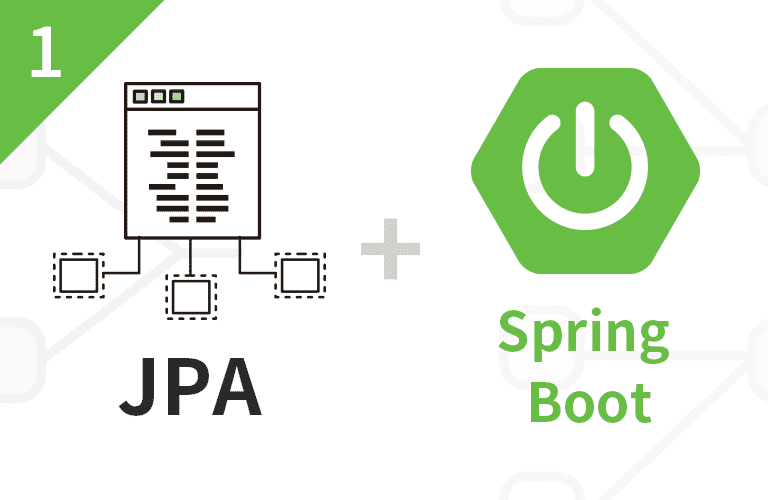

# hello-core
> 『실전! 스프링 부트와 JPA 활용 1 - 웹 애플리케이션 개발』 강의를 듣고 정리하는 저장소입니다.   This is a repository where you can read, study, and organize 『Practice! Using Spring Boot and JPA 1 - Web application development』.

 

## 목차
- [Section 0. 강좌 소개](document/section0/README.md)
- [Section 1. 프로젝트 환경설정](document/section1/README.md)
- [Section 2. 도메인 분석 설계](document/section2/README.md)
- [Section 3. 애플리케이션 구현 준비](document/section3/README.md)
- [Section 4. 회원 도메인 개발](document/section4/README.md)
- [Section 5. 상품 도메인 개발](document/section5/README.md)
- [Section 6. 주문 도메인 개발](document/section6/README.md)
- [Section 7. 웹 계층 개발](document/section7/README.md)
