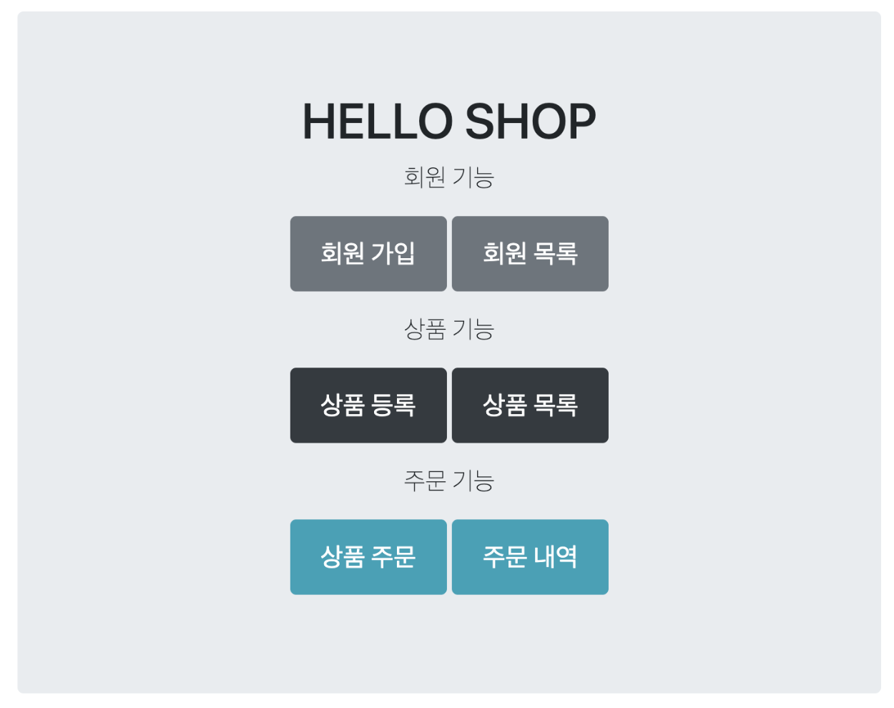
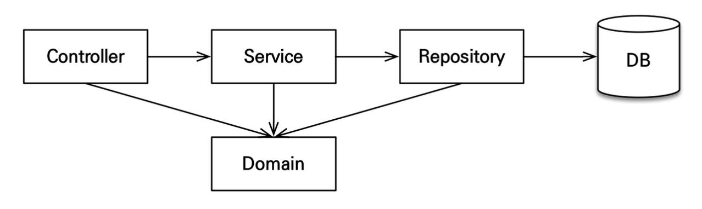

# Section 3. 어플리케이션 구현 준비

어플리케이션을 어떻게 구현할지에 대한 **구현 요구사항**과 **어플리케이션 아키텍처**에 대해서 설명한다.

이전에 진행한 도메인 분석 설계는 데이터적인 설계이고, 무엇을 어디까지 구현할 건지에 대해서 전체적으로 설명을 진행한다.

## 구현 요구사항

- 회원 기능
    - 회원 등록
    - 회원 조회
- 상품 기능
    - 상품 등록
    - 상품 수정
    - 상품 조회
- 주문 기능
    - 상품 주문
    - 주문 내역 조회
    - 주문 취소

**핵심 비즈니스 메소드를 먼저 구현하는 것에 초점을 맞춘다.**

예제를 단순화하기 위해서 구현하지 않는 기능
- 로그인, 권한 관리
- 파라미터 검증, 예외 처리 (단순화)
- 상품 (도서 이외는 사용하지 않음)
- 카테고리 (사용하지 않음)
- 배송 정보 (사용하지 않음)

## 어플리케이션 아키텍처

### 계층형 구조 사용

- Controller, Web: 웹 계층
- Service: 핵심 비즈니스 로직, 트랜잭션 처리
- Repository: JPA를 직접 사용하는 계층, 엔티티 매니저 사용
- Domain: 엔티티가 모여 있는 계층, 모든 계층에서 사용

Controller에서 Service만 호출할 수 있는 구조가 아닌 Controller에서 Repository에도 바로 접근할 수 있는 구조
- 방향은 단방향으로 흐르도록
- 간단한 조회할 때는 Controller에서 Repository에 바로 접근하는 방식
- 실용적인 관점에서 접근

### 패키지 구조

- `jpabook.jpashop`
    - domain
    - exception
    - repository
    - service
    - web

개발 순서: 핵심 비즈니스 계층(도메인, 서비스, 레포지토리 계층) 개발 → 테스트 케이스로 검증 → 웹 계층(컨트롤러, 웹) 적용
